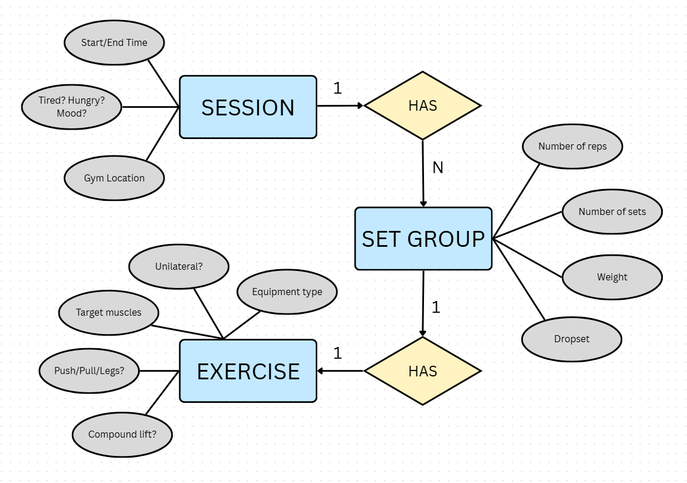

# Personal-Gym-Logbook-Dataset

At the start of 2026, I decided to record my gym sessions in an Excel Workbook. Soon, I plan on putting together a dashboard to analyse my progress, and maybe even make machine-learning-based forecasts and future targets!

The data is contained in three tables, along with a dictionary for heading explanation: 

- **Set groups**, which tracks what exercises were carried out, with what weights, for how many reps and sets.
- **Excercises**, which lists all the movements one would perform at the gym, the equipment used, the muscles targeted, etc.
- **Sessions**, which has information specific to each session at the gym (when and where it took place, etc).

Each table is linked using primary keys and foreign keys where appropriate. This dataset makes for good SQL practice, feel free to fry it out :)
Also included is a SQL file with practice queries written from scratch.

Here's an ER diagram for the data, explaining table relationships:

